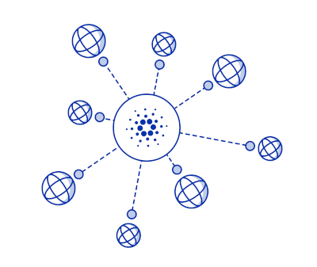

 <a href="https://fivebinaries.com/"></a>

# Cardano Metadata Oracle

This repository contains the code and configuration files of the metadata oracle for Cardano.

<p align="center">
  <a href="#key-features">Key Features</a> •
  <a href="#installation">Installation</a> •
  <a href="#usage">Usage</a> •
  <a href="#configuration">Configuration</a> 
</p>
<br><br>

## Key Features

-   Data source definition templates that are easy to share within the community
-   Fetching and scraping data with error handling and retries
-   Transaction construction, including dynamic fee estimation
-   Support for remote API [Blockfrost.io](https://blockfrost.io)
-   Support for full local Cardano node (using `cardano-cli`)
-   Prometheus style endpoint for monitoring and Grafana integration

## Installation

### NixOS

If you are not running NixOS, you need to at least install [Nix](https://nixos.org/download.html)

```console
$ curl -L https://nixos.org/nix/install | sh
```

After installing Nix, add the following to `/etc/nix/nix.conf` to take advantage of the cache, so you do not have to rebuild everything. After adding it, you need to restart the `nix-daemon` service.

```console
substituters         = https://cache.nixos.org
trusted-public-keys  = cache.nixos.org-1:6NCHdD59X431o0gWypbMrAURkbJ16ZPMQFGspcDShjY=
```

If you are using NixOS, you probably know how to add these as your binary caches.

### Docker

First, build the docker container and then run this within the repository:

```console
$ docker build . -t cardano-metadata-oracle
```

After building your container, just run it:

```console
$ docker run cardano-metadata-oracle --help
```

### Docker Hub

We're also hosting the image directly on Docker Hub. Run it direclty by using:

```console
$ docker run fivebinaries/cardano-metadata-oracle --help
Unable to find image 'fivebinaries/cardano-metadata-oracle:latest' locally
latest: Pulling from fivebinaries/cardano-metadata-oracle
USAGE
  $ cardano-metadata-oracle
```

## Usage

For lightweight Cardano metadata node, you need to use a remote API such as [Blockfrost.io](https://blockfrost.io). Go to [their website](https://blockfrost.io/dashboard) and retrieve a `project_id` for the specific network you want to use (Mainnet or Testnet).

```bash
export BLOCKFROST_PROJECT_ID=your_blockfrost_project_id
```


To post your datapoint to the Cardano network, you need to provide at least `origin-file` and `seed-file` of the wallet containing the funds to do posting. You can use files in the `test` folder.

When using the Cardano full node, make sure you set the environmental variable `CARDANO_NODE_SOCKET_PATH` to the socket file of the node.

## Configuration

### Origins

The metadata oracle node needs a list of origins from where to fetch the data. The source of this file is specified using`--seed-file`. It is a simple YAML file, using the `ticker` as the top element with a list sources for given ticker. In the example below, we define two sources for ticker `ADAUSD`. The `path` proprieties specifies the position within the _json_ document.

_There are many possible expressions you can use in `path` to extract the data you need. For full syntax and more examples head to [jsonpath documentation](https://github.com/dchester/jsonpath#readme)._

```yarm
ADAUSD:
  - name: coinGecko
    url: https://api.coingecko.com/api/v3/coins/cardano?localization=false&tickers=false&market_data=true
    path: '$.market_data.current_price.usd'
    abort_on_failure: true
  - name: cryptoCompare
    url: https://min-api.cryptocompare.com/data/pricemulti?fsyms=ADA&tsyms=USDD&api_key=6e49d40fcabeb5e
    path: '$.ADA.USD'
```

Have a look in the [`test/data/`](test/data/) directory for inspiration.

### Wallet

The Cardano metadata node by default tries to sign and post the transaction to the blockchain. In order to do this, we need a wallet with funds. This is being defined by the `--seed-file` switch pointing to the _ED25519-BIP32_ seed word phrase.

Keep sane permissions on this file as it contains sensitive information. Also, it is best practice to keep only a small amount of funds on this wallet and top it up from time to time.

If you want to construct only a transaction and sign it offline, use the `--address` switch.

### Cardano network (optional)

By default, the node uses Cardano mainnet network. To post to testnet network, use the `network=testnet` switch.

### Metadata label (optional)

By default, we're using matadata label `1968` as per [nut.link](https://nut.link) specification. If you have a specific use case, it might be a good idea to use a different label.

### Prometheus endpoint (optional)

You have the possibility to export prometheus-style file with the current address balance, the time of last run and the execution time. This will help you a lot with monitoring of your oracle.
