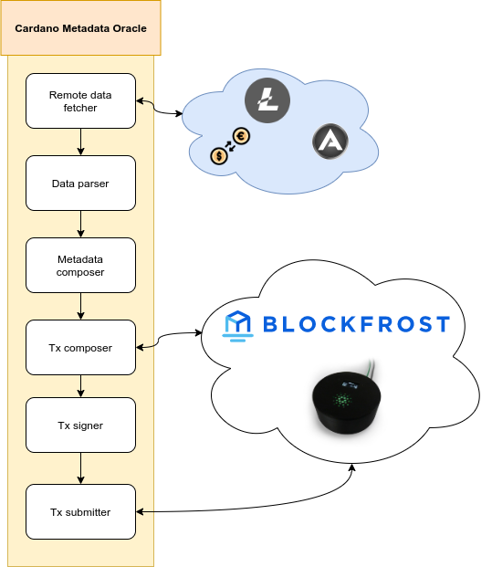

# Cardano oracle node architecture

Cardano oracle node is a tool that retires various remote data, have ability for parsing it and composes a resulting Cardano metadata payload, which can be signed and submitted it to the Cardano blockchain network.

## Components

<p align="center">
  
</p>

### Remote data fetcher

Remote data fetcher component is responsible for fetching the data from a remote web server. At the moment we're supporting just `http` and `https` protocols. This correspons to the `source:` YAML propriety in our source file that is set by the `--origin-file` command line option.

### Data parser

Data parser is responsibile for parsing the payload out of the fetched data in the previous step. Handling of the fetched data corresponding to the JSON path expression specified in the `path:` propriety.

### Metadata composer

After we have fetched the data from the origin and parsed the values out of it, the metadata composer is responsible for building the [resulting metadata payload](https://github.com/input-output-hk/cardano-node/blob/master/doc/reference/tx-metadata.md) that is accepted by the Cardano network.

### Transaction composer

Transaction composer is responsibile for discovering the UTXO set using Blockfrost remote API or local Cardano node and [build the final transaction](https://docs.cardano.org/projects/cardano-serialization-lib/en/latest/getting-started/generating-transactions.html) with minimal necessary fees.

### Transaction signer

A final raw transaction might be signed, the transaction signer will derivate the private key from the seed and sign the transaction.

### Transaction submitter

The final stage is to submit the signed transaction to the Cardano network.

## Command line options

```
$ npx cardano-metadata-oracle --help

Usage: cardano-metadata-oracle [OPTIONS]

Available options:

  --origin-file [FILENAME]             Path to the origin file which contains the list of origins
  --metadata-label [ID]                Integer of the Cardano metadata label as per CIP10 (Optional, default 1968)

  --address [ADDR]                     Address to build the transaction
  --address-derivation-path [PATH]     Derivation path for the address in 'account/chain/address' format (Optional, default 0/0/0)
  --network [mainnet|testnet]          Specify the Cardano network (Optional, mainnet by default)

  --seed-file [FILENAME]               File containing the ED25519-BIP32 seed phrase (Required if not skip-signing)
  --skip-signing                       Skip the signing process, just generate the raw transaction
  --out-file [FILENAME]                Output filepath of a composed transaction

  --backend [cardano-node|blockfrost]  Backend to facilitate communication with the Cardano blockchain.

More information at https://github.com/fivebinaries/cardano-metadata-oracle/.
$
```

## Origin configuration file

This file defines the origins and how to parse the data from them.

```
ticker:
  - name: source_name
    url: https://example.com/api/v0/my.json
    path: '.[0]'
ADAUSD:
  - name: coinGecko
    url: https://api.coingecko.com/api/v3/coins/cardano?localization=false&tickers=false&market_data=true&community_data=false&developer_data=false&sparkline=false
    path: '.market_data.current_price.usd'
    abort_on_failure: true
  - name: cryptoCompare
    url: https://min-api.cryptocompare.com/data/pricemulti?fsyms=ADA,BTC,AGI&tsyms=BTC,USD,EUR,JPY,CAD&api_key=6e49ae35d5ce92b382c90aca9eaf58fed9156099191f23bcd4b65b90fcabeb5e
    path: '.ADA.USD'
```
